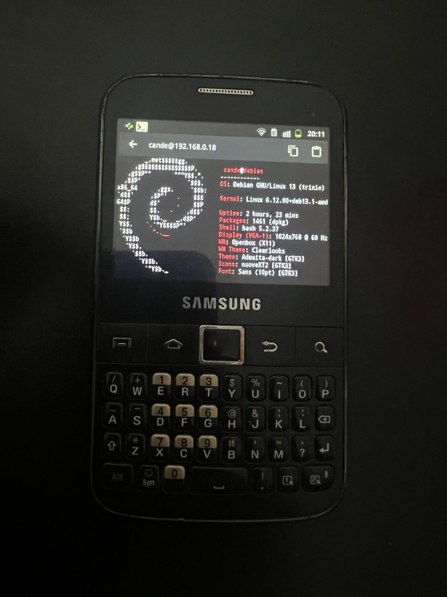

# 📟 Samsung CyberDeck

> **Transformando un Samsung GT-B5510L (2011) en una terminal portátil para administración remota de sistemas Linux.**

  

---

## 🚀 Descripción

Este proyecto documenta el proceso de reutilizar un **Samsung GT-B5510L** con **Android 2.3.6 Gingerbread** para convertirlo en un **CyberDeck**, utilizando SSH para administrar servidores Linux y como base para futuros proyectos de infraestructura y automatización.

El objetivo es demostrar que hardware con más de una década de antigüedad puede seguir siendo útil como herramienta de aprendizaje y administración de sistemas.

---

# ✨ Objetivos

* ♻️ Reutilizar hardware antiguo.
* 🐧 Aprender administración de sistemas Linux.
* 🔐 Configurar acceso remoto mediante SSH.
* 📡 Administrar servidores Debian y FreeBSD.
* 💾 Preparar la base para un servidor NAS.
* 🤖 Integrar futuros proyectos IoT y ESP32.

---

# 🛠️ Desafíos

Durante el desarrollo aparecieron varios desafíos técnicos:

* Android **2.3.6 Gingerbread** (fin de soporte).
* Compatibilidad limitada de aplicaciones.
* Obtención de permisos **Root**.
* Configuración del servidor SSH.
* Optimización del sistema para reducir consumo.
* Compatibilidad del teclado físico QWERTY.

---

# ✅ Soluciones implementadas

* ✔️ Root del dispositivo.
* ✔️ Eliminación de aplicaciones innecesarias.
* ✔️ Configuración de ADB.
* ✔️ Conexión SSH con Debian.
* ✔️ Conexión SSH con FreeBSD.
* ✔️ Personalización del entorno de terminal.
* ✔️ Optimización para uso como CyberDeck.

---

# 📈 Estado del proyecto

| Característica       |      Estado      |
| -------------------- | :--------------: |
| Root Android         |         ✅        |
| ADB                  |         ✅        |
| SSH Debian           |         ✅        |
| SSH FreeBSD          |         ✅        |
| ConnectBot           |         ✅        |
| Limpieza del sistema |         ✅        |
| Banner SSH           |         ✅        |
| Fastfetch            |         ✅        |
| NAS                  | 🚧 En desarrollo |
| IoT / ESP32          |  📅 Planificado  |

---

# 🧰 Tecnologías

* Android 2.3.6 Gingerbread
* Debian 13
* FreeBSD
* OpenSSH
* ADB
* ConnectBot
* Bash
* tmux
* Fastfetch
* Git & GitHub

---

# 📂 Documentación

La documentación completa se encuentra en la carpeta **docs/**.

- 🔓 [Root](docs/root.md)
- 🔐 [SSH](docs/ssh.md)
- 🧹 [Limpieza del sistema](docs/cleanup.md)
- 📡 [ConnectBot](docs/connectbot.md)
- 🖥️ [Banner SSH](docs/banner.md)
- 💾 [Roadmap NAS](docs/nas-roadmap.md)

---

# 📌 Roadmap

* [x] Root del dispositivo
* [x] Configuración SSH
* [x] Optimización Android
* [x] Documentación inicial
* [ ] Servidor NAS
* [ ] Integración ESP32
* [ ] Automatización del hogar
* [ ] Dashboard de monitoreo

---

> **"Giving old hardware a second life through Linux."** 🐧📟
